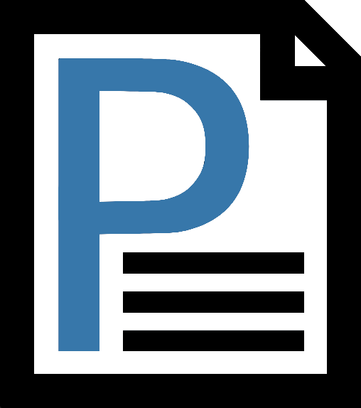

# PAPOFIC

### Papofic lets French\* users choose a template of a document among many others available and only have to fill in their information. Smooth and easy.

 
_* Papofic only supports French localization as of today. It is not yet (and will likely never be) planned to support other languages in the future._

## Link to website

[Link](http://localhost:3000/)

## How you can contribute

### Themed documents

There is a number of themes available from the start, but you may create a theme of your own and offer to have it added in the project. If the theme is up to standards, your theme will be merged into the project.

#### How a theme is compatible:

- The content of the pull request does not change the code in any other way than adding your theme to the code of the variable list and adding the file itself into the theme folder.
- The names of the variables and file are up to standard according to (readme of file names)
- No part of your contribution contains offensive content or slurs in any way
- The css is decent looking and is flexible enough

## Install and launch

The package manager `yarn` is required to install the project's dependencies (`yarn install`) and run the code (`yarn start`).

## Learn More

You can learn more in the [Create React App documentation](https://facebook.github.io/create-react-app/docs/getting-started).

To learn React, check out the [React documentation](https://reactjs.org/).
